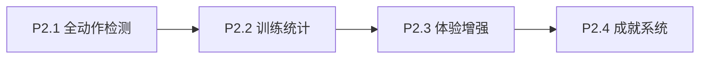
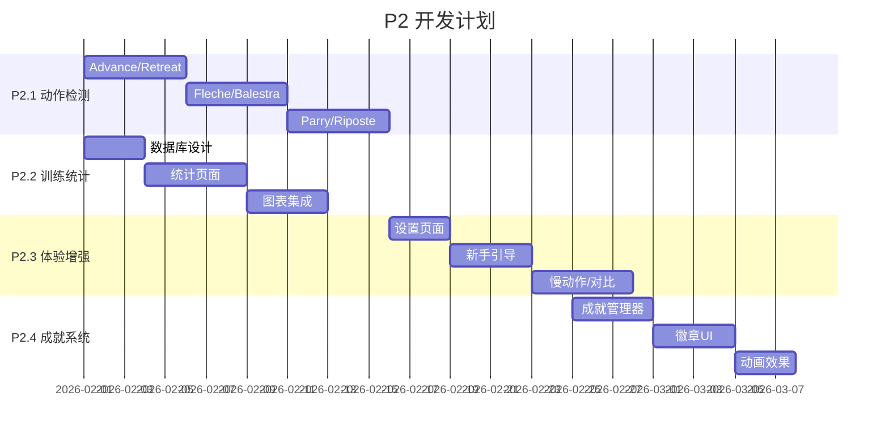

# LittleFencer P2 功能路线图

> **Version:** 2.0  
> **Updated:** 2026-01-31  
> **Target:** 学员自主训练 | 纯本地存储

---

## 📊 P2 功能全景图



---

## P2.1 全佩剑动作检测 (核心)

### 动作清单

| 动作 | 中文 | 检测指标 | 难度 |
|:---|:---|:---|:---:|
| **En Garde** | 预备 | 前膝90-120°, 后腿直, 重心居中 | ✅ 已完成 |
| **Lunge** | 弓步 | 后腿蹬直, 手臂先行, 前膝不超踝 | ✅ 已完成 |
| **Advance** | 前进步 | 前脚先动, 重心平移, 保持En Garde | ⭐⭐ |
| **Retreat** | 后退步 | 后脚先动, 重心平移, 保持En Garde | ⭐⭐ |
| **Advance-Lunge** | 前进弓步 | Advance + Lunge 连续动作 | ⭐⭐⭐ |
| **Fleche** | 飞刺 | 后脚超过前脚, 冲刺速度 | ⭐⭐⭐ |
| **Balestra** | 跳步 | 双脚同时起跳, 落地后立即Lunge | ⭐⭐⭐ |
| **Parry** | 格挡 | 剑臂位置变化, 防守姿态 | ⭐⭐ |
| **Riposte** | 反攻 | Parry后立即出剑 | ⭐⭐⭐ |
| **Recovery** | 回收 | 恢复En Garde姿势 | ✅ 已完成 |

### 技术方案

```kotlin
// FencingStateEngine 扩展
enum class FencingState {
    IDLE, EN_GARDE, 
    ADVANCING, RETREATING,      // P2.1 新增
    LUNGING, FLECHE, BALESTRA,  // P2.1 新增
    PARRYING, RIPOSTING,        // P2.1 新增
    RECOVERY
}

// 动作识别策略
interface ActionDetector {
    fun detect(landmarks: List<PointF>, history: List<PoseFrame>): ActionResult
}
```

### 交付物
- [ ] `AdvanceDetector.kt` - 前进步检测
- [ ] `RetreatDetector.kt` - 后退步检测
- [ ] `FlecheDetector.kt` - 飞刺检测
- [ ] `BalestraDetector.kt` - 跳步检测
- [ ] `ParryRiposteDetector.kt` - 格挡反攻检测
- [ ] 扩展 `FencingStateEngine` 状态机

---

## P2.2 训练统计仪表盘

### 功能设计

| 模块 | 内容 |
|:---|:---|
| **今日概览** | 训练时长、总次数、完美率 |
| **动作分布** | 饼图：各动作练习比例 |
| **错误分析** | 柱状图：常见错误 TOP 5 |
| **趋势图** | 折线图：7日/30日训练量 |
| **目标进度** | 环形进度条：每日目标完成度 |

### 数据模型

```kotlin
@Entity(tableName = "training_sessions")
data class TrainingSession(
    @PrimaryKey val id: Long,
    val date: LocalDate,
    val durationMs: Long,
    val totalReps: Int,
    val perfectReps: Int,
    val actionBreakdown: Map<FencingState, Int>,
    val errorBreakdown: Map<String, Int>
)
```

### 交付物
- [ ] `TrainingDatabase.kt` - Room 数据库
- [ ] `StatisticsRepository.kt` - 统计数据仓库
- [ ] `StatsActivity.kt` - 统计页面
- [ ] `activity_stats.xml` - 统计布局
- [ ] 图表组件 (MPAndroidChart)

---

## P2.3 用户体验增强

### 功能列表

| 功能 | 说明 |
|:---|:---|
| **设置页面** | 灵敏度调节, 语言切换, 音量控制, 阈值微调 |
| **首次引导** | 3步引导: 放置设备 → 站位校准 → 开始训练 |
| **动作示范** | 标准动作 GIF/视频参考 |
| **慢动作回放** | 0.5x 速度回放, 关键帧标注 |
| **对比视图** | 用户动作 vs 标准动作 并排对比 |

### 交付物
- [ ] `SettingsActivity.kt` - 设置页面
- [ ] `OnboardingActivity.kt` - 新手引导
- [ ] `TutorialFragment.kt` - 动作教程
- [ ] `CompareView.kt` - 对比视图组件
- [ ] 慢动作播放器集成

---

## P2.4 成就与激励系统

### 成就徽章设计

| 徽章 | 解锁条件 | 图标 |
|:---|:---|:---:|
| **初出茅庐** | 首次完成训练 | 🥉 |
| **十全十美** | 连续10次完美 | ⭐ |
| **百发百中** | 累计100次Lunge | 🎯 |
| **千锤百炼** | 累计1000次动作 | 🔥 |
| **飞刺大师** | 首次完美Fleche | ⚡ |
| **周末战士** | 连续7天训练 | 📅 |
| **月度冠军** | 月完美率>80% | 🏆 |

### 激励机制

| 触发 | 反馈 |
|:---|:---|
| 解锁新徽章 | 全屏动画 + 音效 + 保存截图 |
| 打破个人记录 | 彩带特效 + TTS "新纪录!" |
| 达成日目标 | 庆祝动画 + 鼓励语 |

### 交付物
- [ ] `AchievementManager.kt` - 成就管理器
- [ ] `AchievementActivity.kt` - 成就展示页
- [ ] `Badge` 资源图标 (drawable)
- [ ] 动画资源 (Lottie)

---

## 📅 迭代计划



---

## 依赖项新增

```kotlin
// build.gradle.kts 新增
dependencies {
    // Room 数据库
    implementation("androidx.room:room-runtime:2.6.1")
    kapt("androidx.room:room-compiler:2.6.1")
    implementation("androidx.room:room-ktx:2.6.1")
    
    // 图表
    implementation("com.github.PhilJay:MPAndroidChart:v3.1.0")
    
    // Lottie 动画
    implementation("com.airbnb.android:lottie:6.3.0")
    
    // Glide 图片加载
    implementation("com.github.bumptech.glide:glide:4.16.0")
}
```

---

## 用户审核

> [!IMPORTANT]
> 请确认：
> 1. P2.1 动作优先级是否调整？
> 2. 是否有其他佩剑动作需要加入？
> 3. 迭代节奏是否合理？
